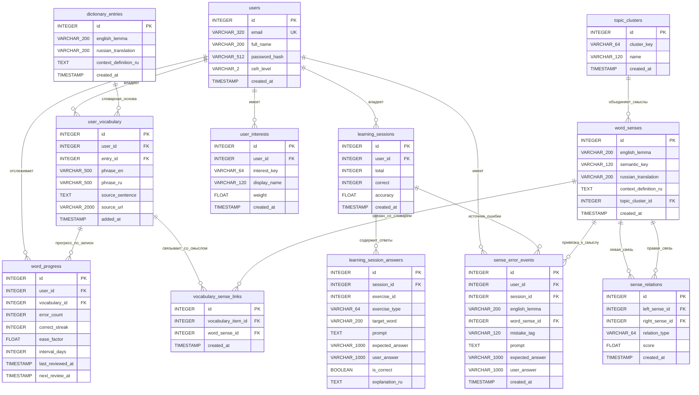

# Схема базы данных

## Текущая продуктовая модель

Практическая схема БД выстроена вокруг реального пользовательского цикла:

1. пользователь существует в `users`
2. слово или фраза попадает в `user_vocabulary`
3. для слов запись опирается на общий словарь `dictionary_entries`
4. слой `review` хранит состояние повторения в `word_progress`
5. учебные попытки фиксируются в `learning_sessions` и `learning_session_answers`
6. модуль `graph` хранит пользовательские интересы, а также общий семантический граф смыслов и связей

Основные сущности:

- `users`
- `dictionary_entries`
- `user_vocabulary`
- `word_progress`
- `learning_sessions`
- `learning_session_answers`
- `user_interests`
- `topic_clusters`
- `word_senses`
- `vocabulary_sense_links`
- `sense_relations`
- `sense_error_events`

## Что важно в текущей схеме

### 1. Словарь нормализован

Словарный слой разделен на:

- `dictionary_entries` — общий словарь смыслов
- `user_vocabulary` — личный словарь пользователя

Это позволяет переиспользовать один и тот же словарный entry между несколькими пользователями без дублирования строк.

### 2. `user_vocabulary` хранит и слова, и фразы

Таблица работает в двух режимах:

- слово: `entry_id` заполнен, `phrase_en` и `phrase_ru` пустые
- фраза: `entry_id` пустой, `phrase_en` и `phrase_ru` заполнены

Из-за этого `entry_id` является nullable, а в таблице есть check-ограничение, запрещающее полностью пустую запись.

### 3. `word_progress` привязан к записи словаря

Повторение больше не живет только на уровне строки `word`. Основной ключ для карточки повторения теперь:

- `(user_id, vocabulary_id)` — одна запись прогресса на одну пользовательскую словарную запись

Поле `word` больше не хранится. Источник истины для карточки повторения теперь только `vocabulary_id`, а сама связь обязательна (`NOT NULL`).

### 4. SRS хранит факты, а не статусы

`word_progress` хранит:

- `error_count`
- `correct_streak`
- `ease_factor`
- `interval_days`
- `last_reviewed_at`
- `next_review_at`

Статусы вроде `due`, `mastered` и `troubled` вычисляются на уровне приложения.

### 5. Семантический граф отделен от пользовательского слоя

Модуль `graph` хранит:

- интересы пользователя в `user_interests`
- общие тематические кластеры в `topic_clusters`
- общие смыслы слов в `word_senses`
- привязку пользовательских словарных записей к общим смыслам в `vocabulary_sense_links`
- общие связи между смыслами в `sense_relations`
- след ошибок на уровне смысла в `sense_error_events`

После денормализации:

- `topic_clusters` больше не содержит `user_id`
- `word_senses` больше не содержит `user_id`, `source_sentence`, `source_url`
- `vocabulary_sense_links` больше не содержит `user_id`
- `sense_relations` больше не содержит `user_id`

Это значит, что учебная логика и семантическая логика остаются связанными, но общий граф смыслов больше не дублируется по пользователям.

### 6. Важные `ON DELETE`-правила

Текущая схема опирается на следующие правила:

- удаление `user_vocabulary` каскадно удаляет связанные строки `word_progress`
- удаление `user_vocabulary` каскадно удаляет `vocabulary_sense_links`
- удаление `word_senses` каскадно удаляет `vocabulary_sense_links`
- удаление `word_senses` каскадно удаляет `sense_relations`
- удаление `learning_sessions` выставляет `sense_error_events.session_id = NULL`
- удаление `word_senses` выставляет `sense_error_events.word_sense_id = NULL`

## Уникальные ограничения

| Таблица | Constraint | Поля |
|---|---|---|
| `users` | UK | `email` |
| `dictionary_entries` | UK | `(english_lemma, russian_translation)` |
| `user_vocabulary` | UK | `(user_id, entry_id)` |
| `user_vocabulary` | UK | `(user_id, phrase_en)` |
| `word_progress` | UK index | `(user_id, vocabulary_id)` |
| `learning_session_answers` | UK | `(session_id, exercise_id)` |
| `user_interests` | UK | `(user_id, interest_key)` |
| `topic_clusters` | UK | `cluster_key` |
| `word_senses` | UK | `(english_lemma, semantic_key)` |
| `vocabulary_sense_links` | UK | `vocabulary_item_id` |
| `sense_relations` | UK | `(left_sense_id, right_sense_id)` |

## Mermaid ER-диаграмма

## Комментарий для защиты

Если показывать схему на защите, удобнее объяснять ее не по таблицам, а по трем слоям:

- словарь: `dictionary_entries`, `user_vocabulary`
- повторение: `word_progress`, `learning_sessions`, `learning_session_answers`
- семантический профиль и граф: `user_interests`, `topic_clusters`, `word_senses`, `vocabulary_sense_links`, `sense_relations`, `sense_error_events`

Так схема выглядит проще и лучше отражает реальные пользовательские сценарии.
