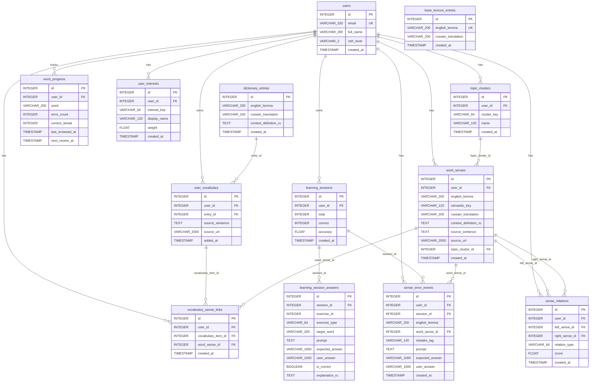

# Схема базы данных

## Текущая упрощенная модель

Практическая схема БД приведена к основному продуктовому циклу: пользователь сохраняет слово, система определяет его смысл, формирует упражнения и обновляет прогресс повторения.

Основные сущности:

- `users`
- `base_lexicon_entries`
- `dictionary_entries` (общий словарь)
- `user_vocabulary` (личный словарь)
- `word_progress`
- `learning_sessions`
- `learning_session_answers`
- `sense_error_events` как след ошибок на уровне смысла слова

Семантическое обогащение:

- `user_interests`
- `topic_clusters`
- `word_senses`
- `vocabulary_sense_links`
- `sense_relations`

## Основные упрощения

### 1. Захват слова стал частью словарного сценария

Выделенный текст сразу обрабатывается внутри сценария словаря. Основными бизнес-сущностями являются `dictionary_entries` (общий словарь) и `user_vocabulary` (личный словарь пользователя).

### 2. `learning_session_answers` хранит структурированные метаданные упражнения

Таблица хранит:

- `exercise_id`
- `exercise_type`
- `target_word`
- `prompt`
- `expected_answer`
- `user_answer`
- `is_correct`
- `explanation_ru`

Благодаря этому система понимает тип упражнения и целевое слово по явным полям.

### 3. Повторение использует один источник состояния

Слой повторения хранит состояние в `word_progress`. Данные профиля пользователя, например CEFR, остаются в `users`, а факты повторения остаются в `word_progress`.

### 4. Повторение хранит факты, а статусы вычисляются

Текущий слой повторения хранит фактические значения:

- `error_count`
- `correct_streak`
- `last_reviewed_at`
- `next_review_at`

Статусы `due`, `mastered` и `troubled` вычисляются в логике приложения и пользовательском интерфейсе.

### 5. Модуль `graph` формирует семантический профиль пользователя

Семантический модуль хранит интересы, смыслы слов, связи словаря со смыслами и связи между смыслами. Его публичный API покрывает пользовательский поток:

- интересы (`/learning-graph/me/interests`)
- создание или обновление семантической записи (`/learning-graph/me/semantic-upsert`)
- слова из профиля интересов (`/learning-graph/me/interest-words`)
- смысловые связи (`/learning-graph/me/anchors`)

### 6. Модуль `review` сфокусирован на повторении

Публичная часть модуля покрывает:

- очередь повторения (`word_progress` с наступившим `next_review_at`)
- запуск сессии повторения
- обновление прогресса повторения
- список прогресса слов с фильтрацией и сортировкой
- план повторения (due + upcoming)
- снимок прогресса (всего слов, освоено, проблемных)
- сводка повторения

## Почему эта версия лучше подходит для диплома

Упрощенная схема сохраняет ключевые возможности проекта:

- персональный словарь с контекстными определениями
- учебные сессии с историей ответов
- интервальные повторения на основе результатов пользователя
- генерацию упражнений с помощью AI и обратную связь
- семантический профиль через `learning_graph`
- общий словарь (`dictionary_entries`) позволяет переиспользовать переводы между пользователями

При этом схема остаётся ближе к демонстрируемому пользовательскому циклу и проще объясняется на защите.

Нормализация словаря на `dictionary_entries` + `user_vocabulary` позволяет также переиспользовать переводы между пользователями без повторных вызовов AI: при добавлении слова, уже имеющегося в общем словаре, перевод и определение берутся из базы напрямую.

## Уникальные ограничения

| Таблица | Constraint | Поля |
|---|---|---|
| `users` | UK | `email` |
| `base_lexicon_entries` | UK | `english_lemma` |
| `dictionary_entries` | UK | `(english_lemma, russian_translation)` |
| `user_vocabulary` | UK | `(user_id, entry_id)` |
| `word_progress` | UK | `(user_id, word)` |
| `learning_session_answers` | UK | `(session_id, exercise_id)` |
| `user_interests` | UK | `(user_id, interest_key)` |
| `topic_clusters` | UK | `(user_id, cluster_key)` |
| `word_senses` | UK | `(user_id, english_lemma, semantic_key)` |
| `vocabulary_sense_links` | UK | `(user_id, vocabulary_item_id)` |
| `sense_relations` | UK | `(user_id, left_sense_id, right_sense_id)` |

## Mermaid ER-диаграмма

