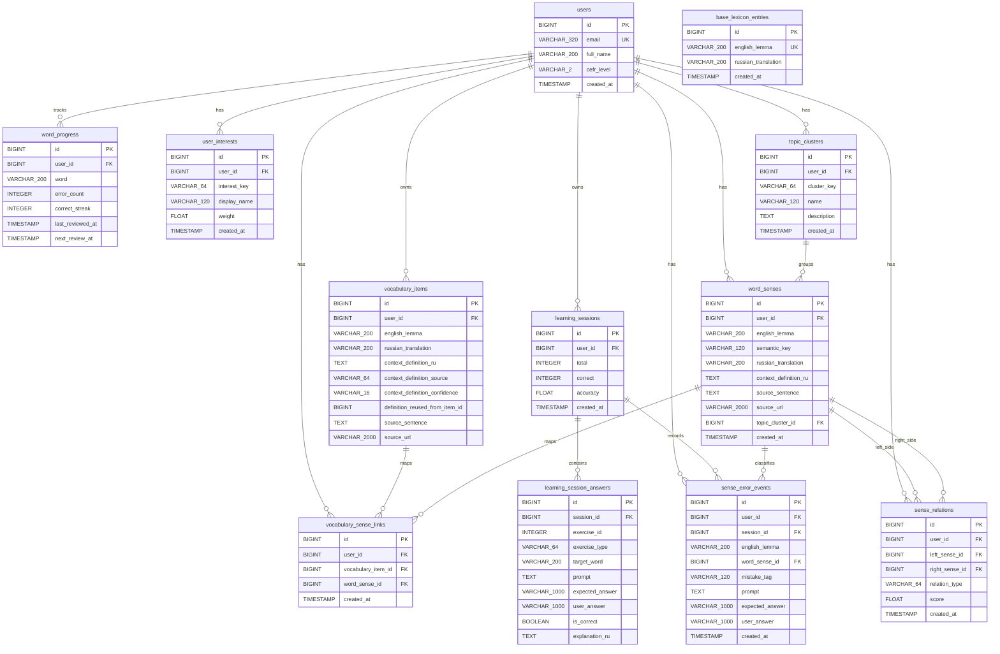

# Схема базы данных

## Текущая упрощенная модель

Практическая схема БД приведена к основному продуктовому циклу: пользователь сохраняет слово, система определяет его смысл, формирует упражнения и обновляет прогресс повторения.

Основные сущности:

- `users`
- `base_lexicon_entries`
- `vocabulary_items`
- `word_progress`
- `learning_sessions`
- `learning_session_answers`
- `sense_error_events` как trace ошибок на уровне смысла слова

Семантическое обогащение:

- `user_interests`
- `topic_clusters`
- `word_senses`
- `vocabulary_sense_links`
- `sense_relations`

## Основные упрощения

### 1. Захват слова стал частью vocabulary flow

Выделенный текст сразу обрабатывается внутри сценария словаря. Основной бизнес-сущностью остается `vocabulary_items`.

### 2. `learning_session_answers` хранит структурированные метаданные упражнения

Таблица хранит:

- `exercise_id`
- `exercise_type`
- `target_word`
- `prompt`
- `expected_answer`
- `user_answer`
- `is_correct`
- `explanation_ru`

Благодаря этому система понимает тип упражнения и целевое слово по явным полям.

### 3. Review использует один источник состояния

Слой повторения хранит состояние в `word_progress`. Данные профиля пользователя, например CEFR, остаются в `users`, а факты повторения остаются в `word_progress`.

### 4. Review хранит факты, а статусы вычисляются

Текущий review-слой хранит фактические значения:

- `error_count`
- `correct_streak`
- `last_reviewed_at`
- `next_review_at`

Статусы `due`, `mastered` и `troubled` вычисляются в application logic и UI.

### 5. `learning_graph` формирует semantic profile пользователя

Семантический модуль хранит интересы, смыслы слов, связи словаря со смыслами и связи между смыслами. Его публичный API покрывает пользовательский поток:

- интересы
- semantic upsert
- слова из профиля интересов
- anchors

### 6. `context_memory` сфокусирован на повторении

Публичная часть модуля покрывает:

- review queue
- запуск review session
- обновление прогресса повторения
- список word progress
- review plan
- progress snapshot
- review summary

## Почему эта версия лучше подходит для диплома

Упрощенная схема сохраняет ключевые возможности проекта:

- персональный словарь с контекстными определениями
- учебные сессии с историей ответов
- интервальные повторения на основе результатов пользователя
- AI-assisted генерацию упражнений и feedback
- semantic profile через `learning_graph`

При этом схема остается ближе к демонстрируемому пользовательскому циклу и проще объясняется на защите.

## Mermaid ER-диаграмма

