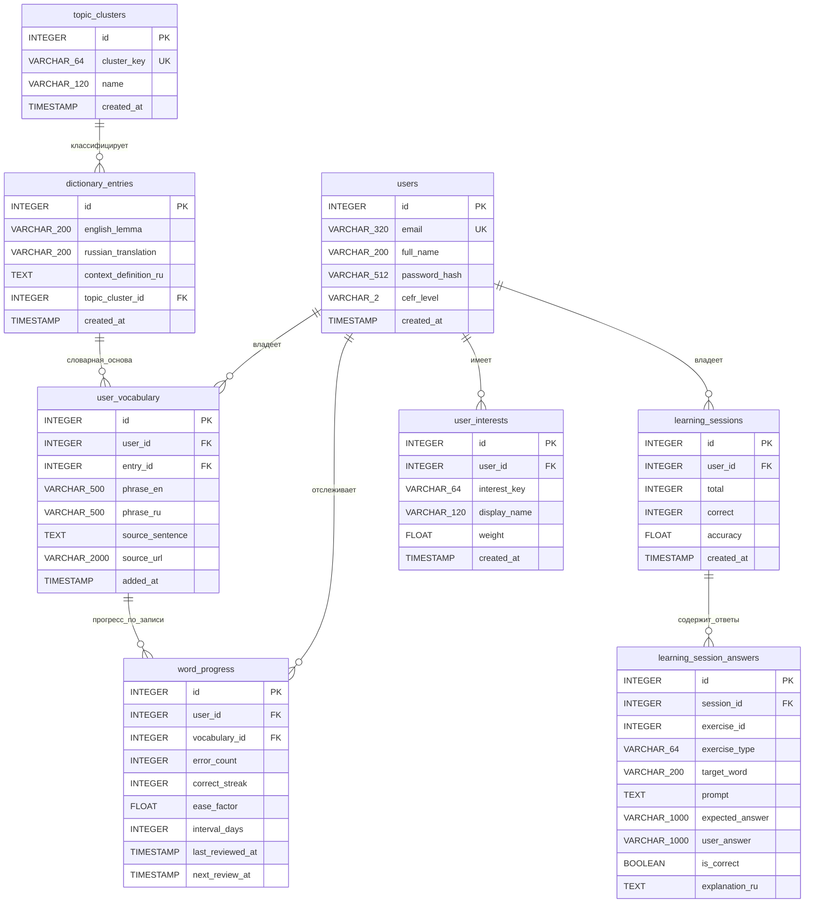

# Схема базы данных

## Текущая продуктовая модель

Схема выстроена вокруг пользовательского цикла изучения слов:

1. Пользователь существует в `users`
2. Слово или фраза попадает в `user_vocabulary`
3. Для слов запись опирается на общий словарь `dictionary_entries`
4. Каждая запись словаря классифицируется по теме через `topic_clusters`
5. Слой `review` хранит состояние повторения в `word_progress`
6. Учебные попытки фиксируются в `learning_sessions` и `learning_session_answers`
7. Пользовательские интересы по темам хранятся в `user_interests`

Таблицы:

- `users`
- `topic_clusters`
- `dictionary_entries`
- `user_vocabulary`
- `word_progress`
- `learning_sessions`
- `learning_session_answers`
- `user_interests`

## Ключевые решения схемы

### 1. Словарь нормализован с тематической классификацией

Словарный слой разделён на:

- `dictionary_entries` — общий словарь смыслов, разделяемый между всеми пользователями
- `user_vocabulary` — личный словарь пользователя (ссылки на `dictionary_entries`)

Каждая запись `dictionary_entries` имеет `topic_cluster_id` — ссылку на тематический кластер
(technology, business, travel, education, daily-life, nature). Кластер определяется эвристически
при добавлении слова и используется для рекомендаций новых слов по интересам.

### 2. `user_vocabulary` хранит и слова, и фразы

Таблица работает в двух режимах:

- **слово**: `entry_id` заполнен, `phrase_en` и `phrase_ru` пустые
- **фраза**: `entry_id` пустой, `phrase_en` и `phrase_ru` заполнены

Check-ограничение `ck_user_vocabulary_word_or_phrase` запрещает полностью пустую запись.

### 3. SRS хранит факты, статусы вычисляются

`word_progress` хранит сырые данные алгоритма SM-2:

| Поле | Назначение |
|---|---|
| `error_count` | Количество ошибок за всё время |
| `correct_streak` | Текущая серия правильных ответов |
| `ease_factor` | Коэффициент лёгкости (SM-2), по умолчанию 2.5 |
| `interval_days` | Текущий интервал повторения в днях |
| `last_reviewed_at` | Дата последнего повторения |
| `next_review_at` | Запланированная дата следующего повторения |

Статусы `due`, `mastered`, `troubled`, `upcoming` вычисляются на уровне приложения,
не хранятся в БД.

Ключ карточки: `(user_id, vocabulary_id)` — одна запись прогресса на одну словарную запись.

### 4. Профиль интересов строится автоматически

При каждом добавлении слова в словарь:

1. Инферируется тема слова по лексическим маркерам
2. В `topic_clusters` создаётся (или переиспользуется) кластер
3. В `dictionary_entries.topic_cluster_id` сохраняется ссылка на кластер
4. В `user_interests` накапливается вес интереса пользователя к этой теме

Рекомендации новых слов (`/learning-graph/me/interest-words`) строятся как:
`dictionary_entries JOIN topic_clusters WHERE cluster_key IN (интересы пользователя) AND lemma NOT IN (личный словарь)`.

### 5. Правила `ON DELETE`

| Что удаляется | Что происходит |
|---|---|
| `user_vocabulary` | Каскадно удаляются связанные `word_progress` |
| `topic_clusters` | `dictionary_entries.topic_cluster_id` становится NULL |

## Уникальные ограничения

| Таблица | Поля | Назначение |
|---|---|---|
| `users` | `email` | Один аккаунт на email |
| `dictionary_entries` | `(english_lemma, russian_translation)` | Один смысл = одна запись |
| `user_vocabulary` | `(user_id, entry_id)` | Слово добавляется один раз |
| `user_vocabulary` | `(user_id, phrase_en)` | Фраза добавляется один раз |
| `word_progress` | `(user_id, vocabulary_id)` | Одна карточка на словарную запись |
| `learning_session_answers` | `(session_id, exercise_id)` | Один ответ на упражнение в сессии |
| `user_interests` | `(user_id, interest_key)` | Один интерес по ключу на пользователя |
| `topic_clusters` | `cluster_key` | Глобальная уникальность кластера |

## Индексы

Помимо индексов по первичным ключам и уникальных ограничений, добавлены:

| Таблица | Индекс | Для запроса |
|---|---|---|
| `word_progress` | `(user_id, next_review_at)` | SRS: слова пользователя со сроком повторения |
| `dictionary_entries` | `english_lemma` | Поиск записей по лемме |
| `dictionary_entries` | `topic_cluster_id` | Рекомендации по интересам |

## Mermaid ER-диаграмма

## Слои для объяснения на защите

| Слой | Таблицы | Назначение |
|---|---|---|
| Пользователи | `users` | Аутентификация, профиль, уровень CEFR |
| Словарь | `dictionary_entries`, `user_vocabulary` | Общий словарь + личные записи |
| Повторение | `word_progress` | SM-2 состояние карточки |
| Обучение | `learning_sessions`, `learning_session_answers` | История упражнений |
| Интересы | `topic_clusters`, `user_interests` | Тематический профиль, рекомендации |
