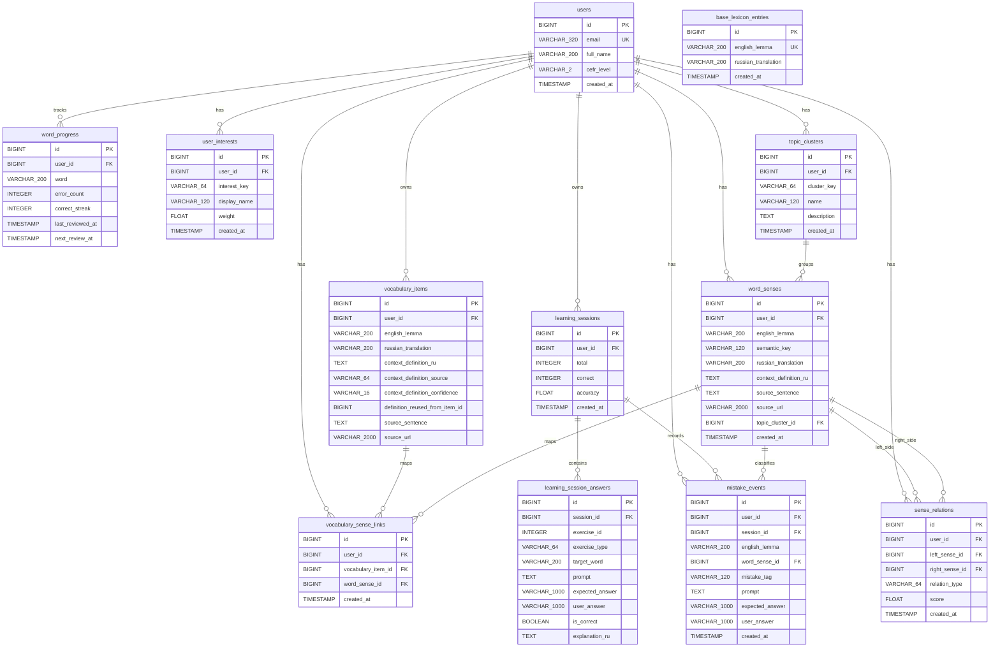

# Database Schema

## Current simplified model

After the simplification pass, the practical schema is intentionally closer to the real product loop and less overloaded with future-facing links.

Core entities:
- `users`
- `base_lexicon_entries`
- `vocabulary_items`
- `word_progress`
- `learning_sessions`
- `learning_session_answers`
- `mistake_events`

Semantic enrichment:
- `user_interests`
- `topic_clusters`
- `word_senses`
- `vocabulary_sense_links`
- `sense_relations`

## Main simplifications

### 1. Capture is now an internal step of the vocabulary flow

Selected text is processed immediately inside the vocabulary scenario and is no longer persisted as a standalone table. The main business entity remains `vocabulary_items`.

### 2. `learning_session_answers` stores structured exercise metadata

The table keeps:
- `exercise_id`
- `exercise_type`
- `target_word`
- `prompt`
- `expected_answer`
- `user_answer`
- `is_correct`
- `explanation_ru`

This removes the previous dependence on parsing `prompt` text to understand what kind of exercise was shown and which word it was about.

### 3. Review uses one source of truth

The review layer now uses only `word_progress` as its state storage. User profile data such as CEFR remains in `users`, and review-specific facts remain in `word_progress`.

### 4. Review keeps facts, not derived states

The current review layer uses `word_progress` and stores only factual values:
- `error_count`
- `correct_streak`
- `last_reviewed_at`
- `next_review_at`

Statuses such as "due", "mastered" or "troubled" are derived from these fields in application logic and UI. They are not stored separately.

### 5. `learning_graph` is preserved as an enrichment layer

The semantic module still stores interests, senses, sense links and relations, but its public API was reduced to the parts that affect the user flow:
- interests
- semantic upsert
- recommendations
- anchors

Auxiliary observability endpoints were removed from the public surface.

### 6. `context_memory` is focused on review flow

The public part of the module now focuses on:
- review queue
- review session start
- review progress updates
- word progress listing
- review plan
- progress snapshot
- review summary

Cleanup and secondary context-management scenarios are no longer part of the main public flow.

## Why this version is better

The simplified schema still remains strong enough for the graduation project because it preserves:
- personal vocabulary storage with contextual definitions;
- learning sessions with answer history;
- spaced repetition based on user performance;
- AI-supported exercise generation and feedback;
- semantic enrichment through the learning graph.

At the same time, it removes several sources of accidental complexity:
- prompt-based heuristics instead of structured metadata;
- public endpoints that were useful mainly for debugging or compensation;
- review fields that can be derived instead of stored;
- excessive emphasis on capture as a standalone product module.

## Mermaid ER diagram

